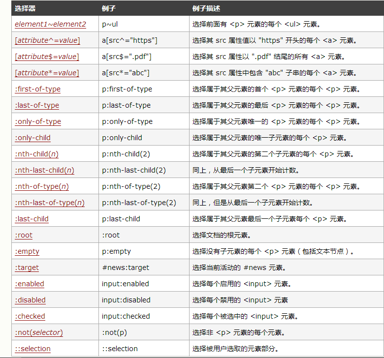

1. 过渡transition： CSS属性，花费时间，效果曲线(默认ease)，延迟时间(默认0)
2. 动画animation：动画名称，一个周期花费时间，运动曲线（默认ease），动画延迟（默认0），播放次数（默认1），是否反向播放动画（默认normal），是否暂停动画（默认running）
3. 形状转换transform：适用于2D或3D转换的元素
	1. rotate(30deg)旋转30°
	2. scale(.8)缩放为原来的80%
	3. skew(10deg,11deg) 沿横坐标扭曲10°，沿纵坐标扭曲11°
	4. rotateX(180deg) 沿着X轴3D旋转180°
	5. rotateY(180deg) 沿着y轴3D旋转180°
	6. rotate3d(10,10,10,90deg) rotate3d(x,y,z,angle)定义 3D 旋转 
4. 选择器   
    <!--more-->
	css3提供的选择器可以让我们的开发，更加方便！这个大家都要了解。下面是css3提供的选择器。  
	
5. 阴影box-shadow: 水平阴影的位置 垂直阴影的位置 模糊距离 阴影的大小 阴影的颜色 阴影开始方向（默认是从里往外，设置inset就是从外往里
6. 边框
	1. border-image: 图片url 图像边界向内偏移 图像边界的宽度(默认为边框的宽度) 用于指定在边框外部绘制偏移的量（默认0） 铺满方式--重复（repeat）、拉伸（stretch）或铺满（round）（默认：拉伸（stretch））
	2. 边框圆角border-radius: n1,n2,n3,n4;*n1-n4四个值的顺序是：左上角，右上角，右下角，左下角。*
7. 背景
    1. background-clip
		1. border-box 默认
		2. padding-box 不算border，相当于把border的背景裁掉
		3. content-box 不算border + padding，相当于把border + padding的背景裁掉
	2. background-origin
		>引用菜鸟教程的说法：background-Origin属性指定background-position属性应该是相对位置
		三个值border-box、padding-box、content-box分别是从边框，padding、content的左上角开始
	3. background-size 指定背景的大小
		>length|percentage|cover|contain   
		设置背景图像的高度和宽度|以父元素的百分比来设置背景图像的宽度和高度|把背景图像扩展至足够大，以使背景图像完全覆盖背景区域|把图像图像扩展至最大尺寸，以使其宽度和高度完全适应内容区域。
8. 反射-webkit-box-reflect:方向[ above-上 | below-下 | right-右 | left-左 ]，偏移量，遮罩图片
9. 文字
	1. 换行word-break: normal|break-all|keep-all  默认|半角空格或者连字符处|允许在单词内
	2. word-wrap: normal|break-word; 默认|允许在长单词或url内部换行
	3. text-overflow: ellipsis|clip|string  超出省略号| 超出隐藏 | 使用给定的字符串来代表被修剪的文本。(只在火狐的浏览器上有用)
	4. 超出省略号
		```
			width:200px; 
			border:1px solid #000000;
			overflow:hidden;
			white-space:nowrap; 
			text-overflow:ellipsis;
		```
	5. 多行超出省略号
	   ```
			width:400px;
			margin:0 auto;
			overflow : hidden;
			border:1px solid #ccc;
			text-overflow: ellipsis;
			padding:0 10px;
			display: -webkit-box;
			-webkit-line-clamp: 2;
			-webkit-box-orient: vertical;
			line-height:30px;
			height:60px;
	   ```
	6. 文字阴影text-shadow:水平阴影，垂直阴影，模糊的距离，以及阴影的颜色。
10. 颜色
	1.  rgba(00,00,00,.5) 一个是rgba（rgb为颜色值，a为透明度）
	2. hsla( 112, 72%, 33%, 0.68) h:色相”，“s：饱和度”，“l：亮度”，“a：透明度”
11. 渐变
	>css3提供了线性渐变、径向渐变、圆锥渐变  
	[CSS3 Gradient](http://www.w3cplus.com/content/css3-gradient)
	[再说CSS3渐变——线性渐变](http://www.w3cplus.com/css3/new-css3-linear-gradient.html)
	[再说CSS3渐变——径向渐变](http://www.w3cplus.com/css3/new-css3-radial-gradient.html)
	[神奇的 conic-gradient 圆锥渐变（这篇就是看我看到圆锥渐变的文章）](http://www.cnblogs.com/coco1s/p/7079529.html)
12. Filter（滤镜）
	1. 黑白色filter: grayscale(100%)
	2. 褐色filter: sepia(1)
	3. 饱和度filter: saturate(2)
	4. 色相旋转filter: hue-rotate(90deg)
	5. 反色filter: invert(1)
	6. 透明度filter: opacity(.5)
	7. 亮度brightness(.5)
	8. 对比度contrast(2)
	9. 模糊blur(3px)
	10. 阴影drop-shadow(5px 5px 5px #000)
13. 弹性布局 flex
	[Flex 布局教程：语法篇](http://www.ruanyifeng.com/blog/2015/07/flex-grammar.html)
	[Flex 布局教程：实例篇](http://www.ruanyifeng.com/blog/2015/07/flex-examples.html)
14. Grid布局
	[Grid布局指南](http://www.jianshu.com/p/d183265a8dad)
15. 多列布局
	```
	.newspaper
	{
	    column-count: 3;
	    -webkit-column-count: 3;
	    -moz-column-count: 3;
	    column-rule:2px solid #000;
	    -webkit-column-rule:2px solid #000;
	    -mox-column-rule:2px solid #000;
	}    
	```
16. 盒模型定义
	box-sizing:content-box/border-box
17. 媒体查询
	```
	@media screen and (max-width: 960px) {
	    body {
	        background-color: darkgoldenrod;
	    }
	}
	@media screen and (max-width: 480px) {
	    body {
	        background-color: lightgreen;
	    }
	}
	```
18. 混合模式--就是允许多个图片/背景合，类似于ps里正片叠底功能
	[css 混合模式](https://blog.csdn.net/u012011360/article/details/88422611)

