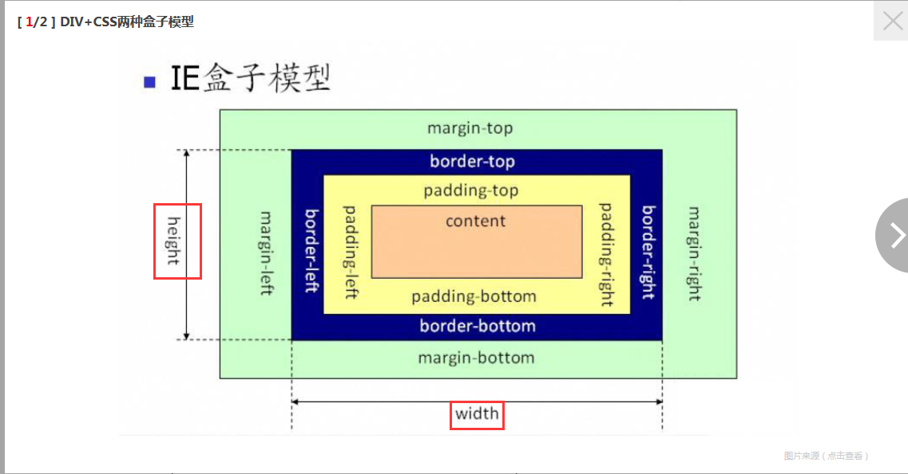

## 1. 什么是BFC元素
这篇文章讲的很好[什么是BFC元素](https://blog.csdn.net/sinat_36422236/article/details/88763187)
## 2. 对于盒模型的理解
### 盒模型  
***盒模型允许我们在元素周围添加边框，并定义元素之间的空间。***  
  **w3c盒模型**

> 从css属性来说，box-sizing: content-box  

从W3C盒模型来看。盒子的width一般指的是盒子的contentWidth，增加内边距、边框和外边距不会影响content的尺寸，但是会增加元素的总尺寸。  
**box-sizing: content-box**
```
元素width = contentWidth  
元素总width = contentWidth + padding + border + margin  
元素总width >= 元素width  
```
**ie盒模型**

> 从css属性来说，box-sizing: border-box  

**与W3C盒模型比之，IE盒模型特性完全相反**
从IE盒模型来看。盒子的width指的就是是盒子的实际宽度，增加内边距、边框和外边距会影响content的尺寸，但是不会增加元素的总尺寸。  
**box-sizing: border-box**
```
元素width = contentWidth + padding + border + margin  
元素总width = contentWidth + padding + border + margin  
元素总width = 元素的width  
```
w3c盒模型与ie盒模型简单来说就是一个用内容width当作元素width，一个用边框来计算width
## 3. css3 新特性
[css3新特性](https://liusongfneg.github.io/2021/04/08/css3/)
## 4. 行内元素和块级元素区别
**行内元素：**  
与其他行内元素并排  
不能设置宽高，默认的宽度就是文字的宽度  
**块级元素：**  
霸占一行，不能与其他任何元素并列。  
能接受宽高，如果不设置宽度，那么宽度将默认变为父级的100%。  
## 5. flex布局特性
[语法篇](http://www.ruanyifeng.com/blog/2015/07/flex-grammar.html)
[实例篇](http://www.ruanyifeng.com/blog/2015/07/flex-examples.html)
任何一个容器都可以指定为 Flex 布局。  
行内元素也可以使用 Flex 布局。  
Webkit 内核的浏览器，必须加上-webkit前缀。  
注意：设为 Flex 布局以后，子元素的float、clear和vertical-alignd等属性将失效。
## 6. rem 和em区别
rem是根据html根节点来计算的，而em是继承父元素的字体。
## 7. 怎么让Chrome支持小于12px 的文字？
以前可以使用Chrome的CSS私有属性-webkit-text-size-adjust:none; 来取消Chrome的字体限制。但是，**在chrome更新到27版本之后就删除了这个属性。**  
-webkit-text-size-adjust:none;只支持英文  
可以使用CSS3里的transform属性来应对这个问题
**scale（缩放）表示转换宽高比例大小。**  
使用transform属性有个问题，它也会影响宽高，这样会对布局产生影响，如图效果。**这是因为transform:scale()只能对块元素设置，设置后宽高也会比例缩放。**
## 8. 怎么让Chrome支持小于12px 的文字？

